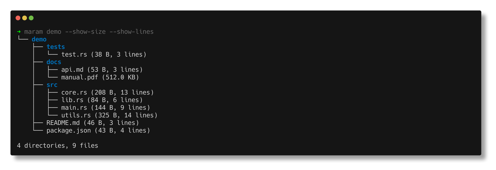
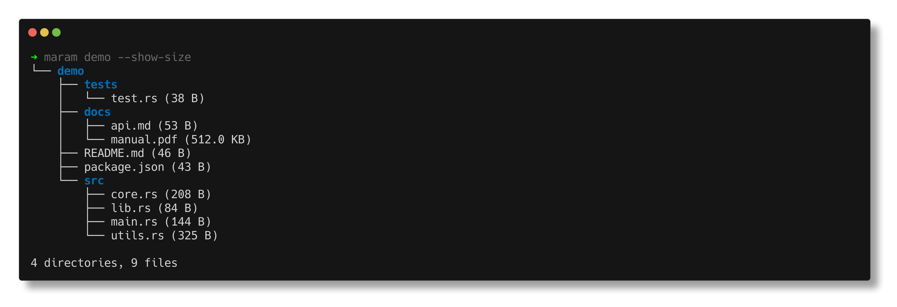
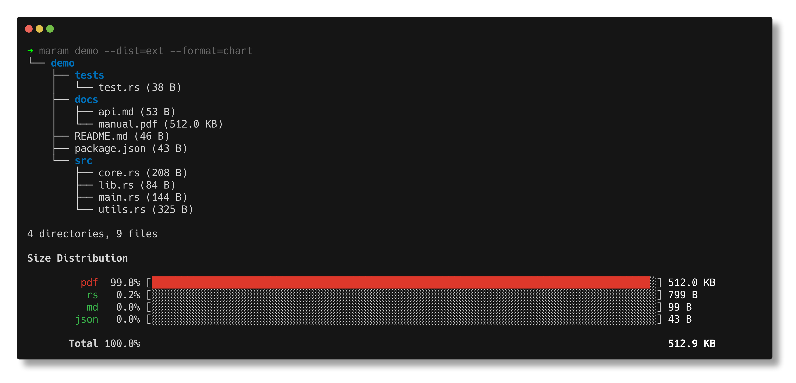
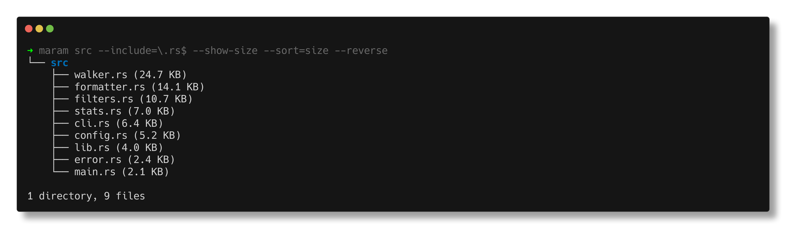
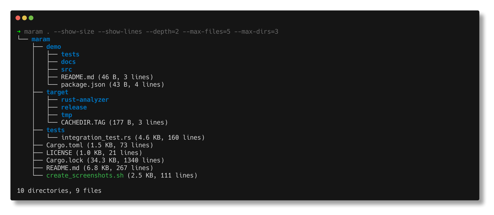

<div align="center">
<table border="0">
<tr>
<td align="left" width="70%">

# 🌳 maram

**A blazing-fast, modern alternative to the Unix `tree` command written in Rust**

[](https://crates.io/crates/maram)
[](https://opensource.org/licenses/MIT)
[](https://crates.io/crates/maram)

**maram** (മരം) - Malayalam word for "tree" - is a high-performance filesystem tree visualizer with advanced features like inline file sizes, line counts, powerful filtering, and beautiful visualizations.

</td>
<td align="right" width="30%">

</td>
</tr>
</table>

<p align="center">
  <a href="#-features">Features</a> •
  <a href="#-installation">Installation</a> •
  <a href="#-quick-start">Quick Start</a> •
  <a href="#-usage">Usage</a> •
  <a href="#-performance">Performance</a> •
  <a href="#-configuration">Configuration</a>
</p>

---



</div>

## ✨ Features

<table>
<tr>
<td>

### 🚀 Performance
- **Blazing Fast** - Custom iterative walker with parallelism
- **Smart Filtering** - Early pruning for efficiency
- **Memory Efficient** - Iterative traversal, no stack limits
- **Platform Optimized** - Direct syscalls on Unix/Linux

</td>
<td>

### 🎨 Rich Display
- **Beautiful Trees** - ASCII/Unicode visualization
- **Inline Metrics** - File sizes and line counts
- **Size Charts** - Visual disk usage distribution
- **Colored Output** - Syntax highlighting for clarity

</td>
</tr>
<tr>
<td>

### 🔍 Advanced Filtering
- **Regex Patterns** - Include/exclude with regex
- **Size Ranges** - Filter by file size
- **Time-based** - Filter by modification time
- **Gitignore** - Respect `.gitignore` files

</td>
<td>

### 🛠️ Flexibility
- **Multiple Formats** - Tree, JSON, CSV, plain text
- **Configurable** - Via `~/.maram.toml`
- **Cross-Platform** - Linux, macOS, Windows
- **Sorting Options** - By name, size, time, type

</td>
</tr>
</table>

## 📦 Installation

<details open>
<summary><strong>Using Cargo (Recommended)</strong></summary>

```bash
cargo install maram
```

</details>

<details>
<summary><strong>From Source</strong></summary>

```bash
git clone https://github.com/mufeedvh/maram
cd maram
cargo install --path .
```

</details>

<details>
<summary><strong>Using Homebrew (macOS/Linux)</strong></summary>

```bash
# Coming soon
brew install maram
```

</details>

## 🚀 Quick Start

```bash
# Display current directory
maram

# Show files with sizes and line counts
maram --show-size --show-lines

# Beautiful Unicode tree with colors
maram -u --show-size

# Filter and sort Rust files by size
maram --include='\.rs$' --sort=size --reverse

# Show disk usage distribution
maram --dist=ext --format=chart
```

## 📸 Screenshots

<details open>
<summary><strong>Click to see more examples</strong></summary>

### 📁 Basic Tree View


### 📊 Size Distribution Chart


### 🎯 Powerful Filtering


### 🎨 Unicode Tree with Colors


### 📈 Project Overview with Limits


</details>

## 📖 Usage

### Basic Commands

| Command | Description |
|---------|-------------|
| `maram` | Display current directory tree |
| `maram /path/to/dir` | Display specific directory |
| `maram -u` | Use Unicode characters for tree |
| `maram --show-lines` | Show line counts for text files |
| `maram --show-size` | Show file sizes inline |

### Filtering Options

| Option | Example | Description |
|--------|---------|-------------|
| `--include` | `--include='\.rs$'` | Include files matching regex |
| `--exclude` | `--exclude='node_modules'` | Exclude paths matching regex |
| `--only-dirs` | `--only-dirs` | Show only directories |
| `--min-size` | `--min-size=1MB` | Show files larger than size |
| `--newer-than` | `--newer-than=1d` | Show files modified recently |
| `--gitignore` | `--gitignore` | Respect .gitignore files |

### Display Options

| Option | Example | Description |
|--------|---------|-------------|
| `--sort` | `--sort=size --reverse` | Sort by size (descending) |
| `--max-files` | `--max-files=10` | Limit files per directory |
| `-L, --depth` | `-L 3` | Maximum depth to traverse |
| `--output` | `--output=json` | Output format (tree/json/csv/plain) |

### Size Distribution

```bash
# Show size distribution by file type
maram --dist=type --format=chart

# Show top 20 largest files by extension
maram --dist=ext --top=20 --format=table

# Show distribution grouped by size buckets
maram --dist=size --format=chart
```

<details>
<summary><strong>See all options</strong></summary>

```bash
maram --help
```

</details>

## ⚡ Performance

maram is designed for speed and efficiency:

<div align="center">

| Benchmark | maram | tree | find | fd |
|-----------|-------|------|------|-----|
| Small directory (318 files) | **2.2ms** | 4.1ms | 3.0ms | 29.6ms |
| Large directory (7,234 files) | **12.4ms** | 89.5ms | 29.8ms | 198.3ms |

</div>

### Why is maram so fast?

- 🔧 **Custom Walker** - Optimized filesystem traversal with inline filtering
- 🚀 **Zero Allocations** - Pre-allocated buffers in hot paths  
- ⚡ **Direct Syscalls** - Bypasses standard library overhead on Unix
- 🔀 **Parallelism** - Multi-threaded processing with rayon
- 🎯 **Smart Pruning** - Skip branches that don't match filters early

## ⚙️ Configuration

Create `~/.maram.toml` to customize defaults:

```toml
[display]
unicode = true          # Use Unicode tree characters
show_size = true        # Always show file sizes
show_lines = false      # Show line counts
dir_sizes = false       # Calculate directory sizes
total_size = true       # Show total size summary

[filters]
show_hidden = false     # Show hidden files
gitignore = true        # Respect .gitignore
max_depth = 10          # Maximum traversal depth
max_files = 100         # Max files per directory
sort_by = "name"        # Sort by: name, size, time, type

[performance]
threads = 0             # CPU threads (0 = auto-detect)
max_file_size = 1073741824  # Max file size for line counting (1GB)
```

## 🤝 Contributing

Contributions are welcome! Please feel free to submit a Pull Request.

## 📄 License

This project is licensed under the MIT License - see the [LICENSE](LICENSE) file for details.

---

<div align="center">
  <sub>Built with ❤️ in Rust by <a href="https://github.com/mufeedvh">Mufeed VH</a></sub>
</div>